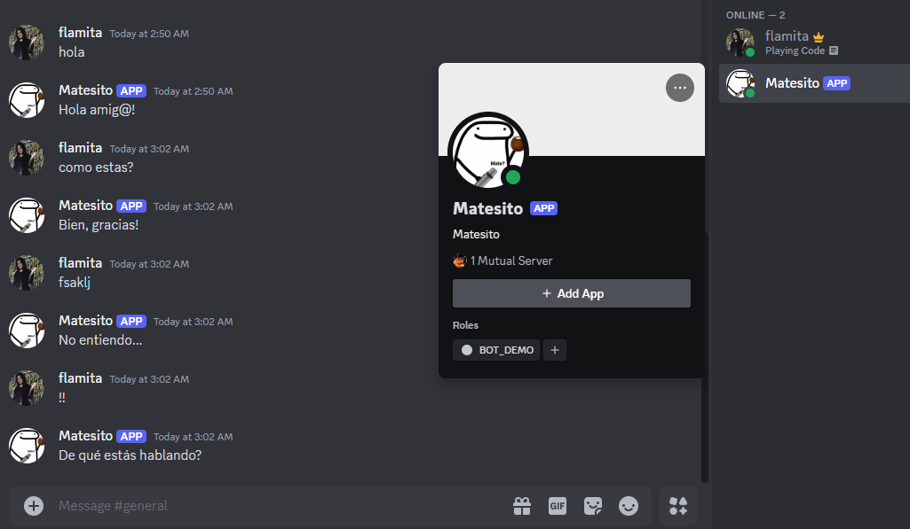

# Create your own bot for Discord

Go to the link below, reset your TOKEN, and use your user password to confirm. Copy the token and replace the value of DISCORD_TOKEN in your .env file:

https://discord.com/developers/applications

In the Bot section under Bot Permissions:

- Enable the Message Content Intent

- Check view channels, send Messages, Read Messages History, Mention Everyone, Send Messages in Threads and then any other permissions you want 🤖📚

This will generate a URL at the end, copy and paste it into your browser to invite the bot to a server

Run the app and start chatting with your bot! 🧷😃

